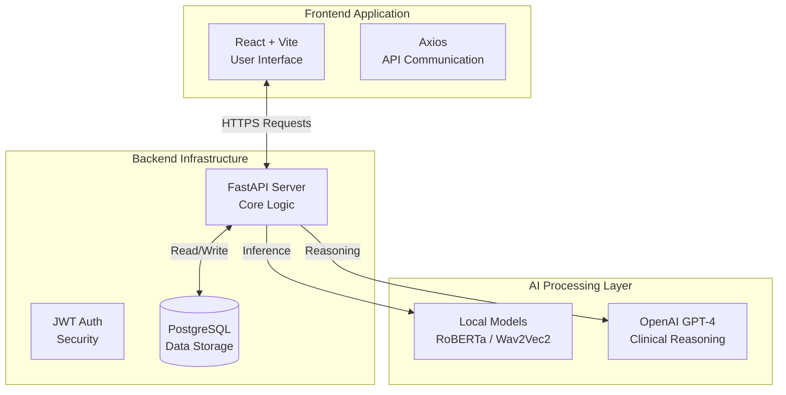
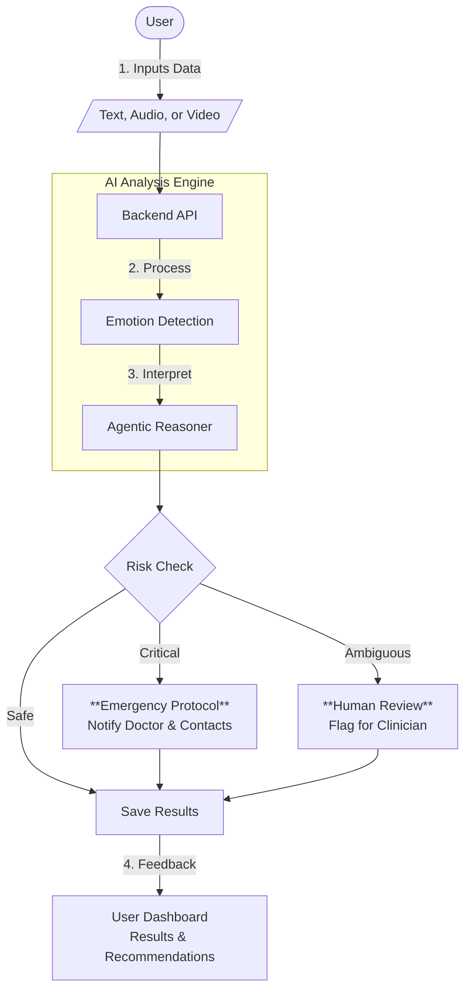
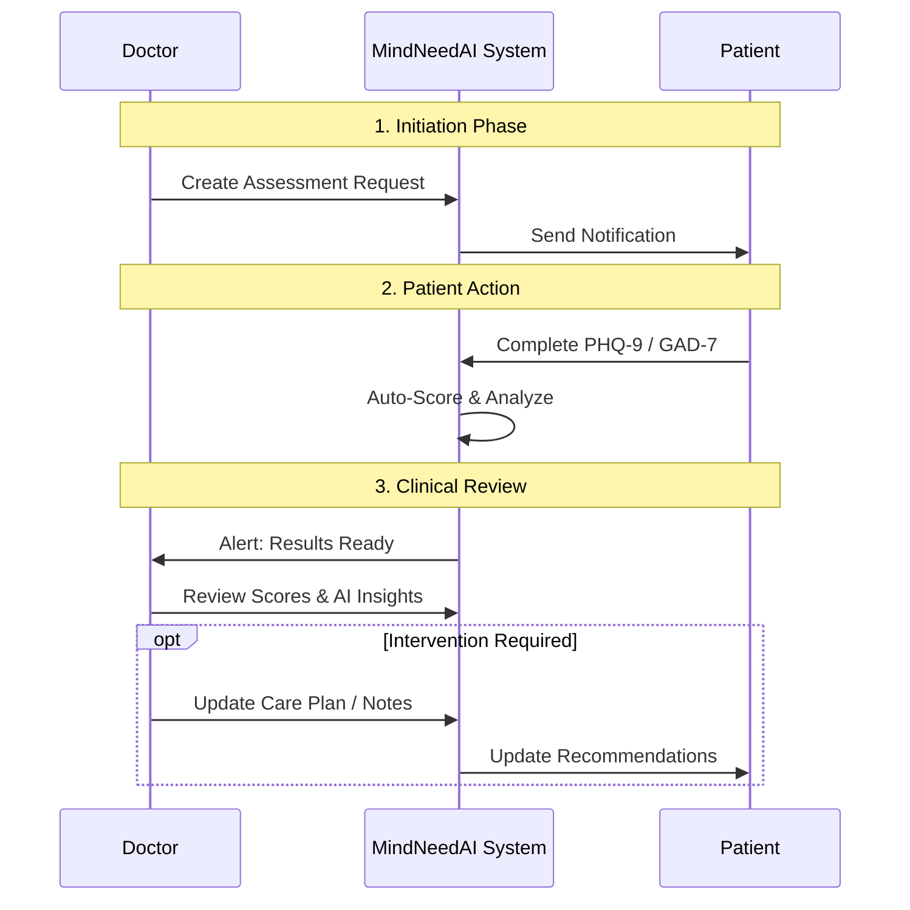

# MindNeedAI Architecture Diagrams

This document provides balanced architectural visualizations for the MindNeedAI platform, offering a clear view of the system's components and workflows without unnecessary complexity.

## 1. Technology Stack Overview

This diagram illustrates the core technologies powering the platform, organized by their role in the system.

---

## 2. Analysis & Safety Workflow

This flowchart details how user input is processed, analyzed for safety, and turned into actionable insights.

---

## 3. Doctor-Patient Care Loop

This diagram demonstrates the collaborative care cycle between doctors and patients, including assessments and wellness forms.

