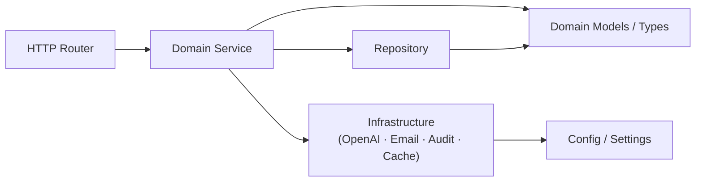

# MindNeedAI — Refactor Architecture

## Current Codebase Problems

### Architecture

- `src/database/models.py` — 3475 lines; 21 ORM models (`AnalysisRecord`, `UserFeedback`, `ReviewRecord`, `ModelVersion`, `MoodEntry`, `HealthMetricsEntry`, `VideoAnalysisSession`, `VideoFrameRecord`, `VideoAnalysisReview`, `AudioAnalysisSession`, `AudioAnalysisReview`, `EmergencyContact`, `EmergencyAlertLog`, `UserProfile`, `Doctor`, `UserPreferences`, `UserDoctorRelationship`, `MentalWellnessForm`, `AssessmentRequest`, `Assessment`, `Notification`) + `DatabaseManager` god class with 100+ methods spanning every domain
- `src/core/` — catch-all folder mixing routers, services, and managers with no single responsibility per file
- `text_analysis/`, `speech_analysis/`, `facial_analysis/` — each independently duplicates `agentic_reasoner.py`, `continuous_learning.py`, `model_manager.py` with no shared base
- `main.py` — flat 19-router registration dump; uses deprecated `@app.on_event("startup")` (removed in FastAPI 0.109+; must be replaced with `lifespan` context manager); startup model preloading runs synchronously blocking app boot
- No `pyproject.toml`, no typed exception hierarchy, no Docker configuration
- No Alembic; hand-rolled `migrate_*.py` scripts with no version tracking
- Zero tests anywhere in the repository

### Configuration

- `src/config/settings.py` wraps every field in `os.getenv()`, which **defeats pydantic-settings' native `.env` resolution entirely** — fields are resolved before pydantic can process them, making validators, type coercion, and env-prefix features inoperative. All `os.getenv()` wrappers must be removed; pydantic-settings handles loading automatically.
- `src/config/settings.py` falls back to hardcoded dev secrets (`"dev_key_change_in_production"`, `"dev_encryption_key"`, `"mindneedai_salt_change_in_production"`) with no runtime guard in non-production envs
- `settings.py` contains `streamlit_port: int = 8501` — dead configuration; no code in the project references this field; remove it

### Bugs (must be fixed during refactor)

- **Session cache reset is silently broken** — `reset_user_history()` in all three recommendation services filters session cache keys with `user_id[:8] in key`, but keys are MD5 hex digests of `(user_id + session_id + emotion_folder)` and never contain a plain user ID prefix. Session entries survive every "reset" call indefinitely. This is both a functional bug and a data-leak for shared-device scenarios.
- **Error response format mismatch** — `src/core/error_handler.py` wraps all errors as `{ "error": { "message": ..., "code": ..., "request_id": ... } }`, but multiple frontend service files read `error.response?.data?.detail` (FastAPI's default format). The result: most error states show a generic fallback message to the user instead of the actual reason.
- **Health check creates a new SQLAlchemy engine on every call** — `GET /health` calls `DatabaseManager()` which runs `_initialize_database()` and creates a new engine + connection pool on each request. Under any polling interval this is a connection leak.
- **OpenAI client declared twice** — the proposed layout places `openai_client.py` inside `analysis/shared/` AND `infra/openai/client.py`. Only the `infra/` location should exist; analysis modules must import from there. Having two definitions would split retry logic, token tracking, and rate-limit state.

### Frontend

- `src/mental_status_exam/` — stale `__pycache__` only; Python source deleted but `frontend/src/services/mentalStatusExamService.ts` still calls `/mental-status-exam/*` which returns 404 on every call
- `frontend/src/pages/HomePage.tsx`, `MyExamsPage.tsx`, `ViewExamPage.tsx`, `CreateExamPage.tsx` — exist on disk but are not imported or routed in `App.tsx`; dead code
- `src/multimodel/text_analysis/docs/` — documentation `.py` files inside the source tree (note: `speech_analysis` and `facial_analysis` doc scripts are correctly placed under the root `Docs/` folder already; only `text_analysis/docs/` needs moving)

---

## Dependency Direction Rule



Routers only call services. Services own business logic and call repositories. Repositories are the only layer that touches SQLAlchemy sessions. Infrastructure adapters are injected into services, never imported directly by routers.

---

## New Repository Layout

```
mindneedai/
│
├── server/                          # Python backend (FastAPI)
│   ├── main.py                      # App factory: create_app(), lifespan, mount routers
│   ├── pyproject.toml               # Project metadata, deps, tool config (replaces requirements.txt)
│   │
│   ├── config/
│   │   └── settings.py              # Pydantic-Settings; all env vars, no hardcoded defaults for secrets
│   │
│   ├── db/
│   │   ├── base.py                  # SQLAlchemy declarative Base, engine factory, session factory
│   │   ├── session.py               # get_db() FastAPI dependency, connection pool config
│   │   │
│   │   ├── models/                  # One ORM model file per domain; all import from db/base.py
│   │   │   ├── user.py              # UserProfile, Doctor, UserDoctorRelationship, UserPreferences
│   │   │   ├── analysis.py          # AnalysisRecord, UserFeedback, ReviewRecord, ModelVersion
│   │   │   ├── video_analysis.py    # VideoAnalysisSession, VideoFrameRecord, VideoAnalysisReview
│   │   │   ├── audio_analysis.py    # AudioAnalysisSession, AudioAnalysisReview
│   │   │   ├── mood.py              # MoodEntry
│   │   │   ├── health_metrics.py    # HealthMetricsEntry
│   │   │   ├── assessment.py        # Assessment, AssessmentRequest
│   │   │   ├── wellness_form.py     # MentalWellnessForm
│   │   │   ├── emergency.py         # EmergencyContact, EmergencyAlertLog
│   │   │   ├── notification.py      # Notification
│   │   │   └── recommendation.py    # RecommendationPlayHistory, RecommendationSessionCache
│   │   │
│   │   └── repositories/            # One repository per model group; all accept db: Session
│   │       ├── base.py              # Generic[T] base repository: get, list, create, update, delete
│   │       ├── user_repo.py         # UserRepository, DoctorRepository, RelationshipRepository
│   │       ├── analysis_repo.py     # AnalysisRepository, ReviewRepository, FeedbackRepository
│   │       ├── video_repo.py        # VideoSessionRepository, VideoFrameRepository
│   │       ├── audio_repo.py        # AudioSessionRepository
│   │       ├── mood_repo.py         # MoodRepository
│   │       ├── health_metrics_repo.py # HealthMetricsRepository
│   │       ├── assessment_repo.py   # AssessmentRepository, AssessmentRequestRepository
│   │       ├── wellness_form_repo.py # WellnessFormRepository
│   │       ├── emergency_repo.py    # EmergencyContactRepository, AlertLogRepository
│   │       ├── notification_repo.py # NotificationRepository
│   │       └── recommendation_repo.py # RecommendationPlayHistoryRepository, SessionCacheRepository
│   │
│   ├── migrations/                  # Alembic migration environment
│   │   ├── env.py                   # Alembic env; imports all db/models/* for autogenerate
│   │   ├── script.py.mako           # Migration script template
│   │   └── versions/                # Auto-generated versioned migration scripts
│   │
│   ├── analysis/                    # All ML/AI inference; no HTTP layer here
│   │   ├── shared/                  # Shared base classes extracted from the three duplicated stacks
│   │   │   ├── base_analyzer.py     # Abstract BaseAnalyzer: load_model(), predict(), unload()
│   │   │   ├── base_reasoner.py     # Abstract BaseReasoner: build_prompt(), call_llm(), parse_response()
│   │   │   ├── base_learner.py      # Abstract BaseLearner: collect_feedback(), trigger_cycle()
│   │   │   └── base_model_manager.py # Abstract BaseModelManager: versioning, activation, rollback
│   │   │   # openai_client.py does NOT belong here — import from infra/openai/client.py only
│   │   │
│   │   ├── text/
│   │   │   ├── analyzer.py          # RoBERTa inference, confidence calibration
│   │   │   ├── reasoner.py          # GPT-4 text prompt builder + clinical insight parser
│   │   │   ├── learner.py           # Feedback collection, fine-tune dataset prep
│   │   │   └── model_manager.py     # HuggingFace model versioning for text models
│   │   │
│   │   ├── speech/
│   │   │   ├── analyzer.py          # Wav2Vec2 emotion inference, audio preprocessing
│   │   │   ├── reasoner.py          # GPT-4 speech prompt builder + prosodic insight parser
│   │   │   ├── learner.py           # Speech feedback loop and dataset management
│   │   │   └── model_manager.py     # Wav2Vec2 model versioning
│   │   │
│   │   └── facial/
│   │       ├── analyzer.py          # ResNet/LSTM + MediaPipe face pipeline
│   │       ├── reasoner.py          # GPT-4 facial prompt builder + expression insight parser
│   │       ├── learner.py           # Video session feedback and training data prep
│   │       └── model_manager.py     # PyTorch model versioning for facial models
│   │
│   ├── features/                    # Vertical slices; each owns router + schemas + service
│   │   │
│   │   ├── auth/
│   │   │   ├── router.py            # POST /auth/register/user|doctor, /login, /logout, /change-password
│   │   │   ├── schemas.py           # RegisterUserRequest, RegisterDoctorRequest, LoginRequest, AuthResponse
│   │   │   ├── service.py           # Registration, login, JWT issue, password change orchestration
│   │   │   ├── dependencies.py      # get_current_user, get_current_doctor, get_current_user_or_doctor
│   │   │   ├── token_utils.py       # create_access_token, verify_token, decode_token
│   │   │   ├── password_utils.py    # hash_password, verify_password, validate_strength
│   │   │   └── login_guard.py       # Failed-attempt tracking, progressive lockout
│   │   │
│   │   ├── text_analysis/
│   │   │   ├── router.py            # POST /text-analysis/analyze, /feedback; GET /review, /models, /learning
│   │   │   ├── schemas.py           # TextAnalysisRequest, AnalysisResponse, FeedbackRequest
│   │   │   └── service.py           # Orchestrates analyzer → reasoner → review trigger → emergency check → DB
│   │   │
│   │   ├── speech_analysis/
│   │   │   ├── router.py            # POST /audio-analysis/start-session, /analyze-file, /batch; GET /session
│   │   │   ├── schemas.py           # AudioSessionRequest, AudioAnalysisRequest, AudioSessionResponse
│   │   │   └── service.py           # Audio session lifecycle, Wav2Vec2 inference, agentic layer, DB persist
│   │   │
│   │   ├── facial_analysis/
│   │   │   ├── router.py            # POST /video-analysis/start-session, /analyze-frame, /end-session
│   │   │   ├── schemas.py           # StartSessionRequest, FrameAnalysisRequest, EndSessionRequest
│   │   │   └── service.py           # Camera session lifecycle, frame buffering, agentic analysis, DB persist
│   │   │
│   │   ├── recommendations/
│   │   │   ├── music/
│   │   │   │   ├── router.py        # POST /music/recommend, /report-played, /report-failed, /reset-history
│   │   │   │   ├── schemas.py       # MusicRecommendationRequest, MusicRecommendationResponse
│   │   │   │   └── service.py       # Emotion → track mapping, play-history persistence via DB (not JSON)
│   │   │   ├── local_video/
│   │   │   │   ├── router.py        # POST /video/recommend, /report-played, /report-failed, /reset-history
│   │   │   │   ├── schemas.py       # VideoRecommendationRequest, VideoRecommendationResponse
│   │   │   │   └── service.py       # Emotion → local video file mapping, history via DB
│   │   │   └── youtube/
│   │   │       ├── router.py        # POST /youtube/recommend, /report-failure|success; GET /health
│   │   │       ├── schemas.py       # YouTubeRecommendationRequest, YouTubeRecommendationResponse
│   │   │       ├── service.py       # Curated video catalog lookup, exclusion logic, history via DB
│   │   │       └── validator.py     # YouTubeVideoValidator: video health status tracking
│   │   │
│   │   ├── mood/
│   │   │   ├── router.py            # POST/GET/DELETE /mood/entry; GET /mood/weekly
│   │   │   ├── schemas.py           # MoodEntryPayload, MoodEntryResponse, WeeklyMoodData
│   │   │   └── service.py           # Mood CRUD, weekly aggregation
│   │   │
│   │   ├── health_metrics/
│   │   │   ├── router.py            # POST/GET/DELETE /health-metrics/entry; GET /latest
│   │   │   ├── schemas.py           # HealthMetricsEntryRequest, HealthMetricsEntryResponse
│   │   │   ├── service.py           # Vitals persistence + OpenAI interpretation via shared openai_client
│   │   │   └── validator.py         # Range checks for O2, BP, pulse, risk level derivation
│   │   │
│   │   ├── assessments/
│   │   │   ├── router.py            # POST /assessments/phq9|gad7; GET /questions, /history; doctor request routes
│   │   │   ├── schemas.py           # PHQ9Submission, GAD7Submission, AssessmentResponse, AssessmentRequestCreate
│   │   │   ├── service.py           # Submission, scoring, result storage, request lifecycle
│   │   │   ├── scoring.py           # PHQ9ScoringService, GAD7ScoringService, severity classification
│   │   │   ├── questionnaires.py    # Static PHQ-9 and GAD-7 question definitions
│   │   │   └── permissions.py       # Doctor-patient relationship guard for assessment access
│   │   │
│   │   ├── wellness_forms/
│   │   │   ├── router.py            # POST/GET/PUT/DELETE /mental-wellness-form; AI summary routes
│   │   │   ├── schemas.py           # WellnessFormCreate, WellnessFormResponse, AIInsightsResponse
│   │   │   ├── service.py           # Form CRUD, AI insights trigger, doctor approval, patient report send
│   │   │   └── ai_generator.py      # WellnessFormAIGenerator: clinical + patient summaries via OpenAI
│   │   │
│   │   ├── emergency/
│   │   │   ├── router.py            # POST/GET/DELETE /emergency-contacts; GET /alerts/history, /cooldown
│   │   │   ├── schemas.py           # EmergencyContactRequest, AlertHistoryResponse, CooldownStatusResponse
│   │   │   ├── service.py           # Contact CRUD, alert dispatch coordination, cooldown logic
│   │   │   └── alert_manager.py     # EmergencyAlertManager: multi-recipient dispatch, tiered notifications
│   │   │
│   │   ├── notifications/
│   │   │   ├── router.py            # GET /notifications; PUT /read, /read-all; DELETE
│   │   │   ├── schemas.py           # NotificationResponse, NotificationListResponse
│   │   │   └── service.py           # Notification CRUD, unread count, cross-domain event triggers
│   │   │
│   │   ├── user_profile/
│   │   │   ├── router.py            # POST/GET /user-profile; POST /connect-doctor; DELETE /disconnect
│   │   │   ├── schemas.py           # UserProfileRequest, UserProfileResponse, ConnectDoctorRequest
│   │   │   └── service.py           # Profile save/fetch, doctor connection, disconnect, stats
│   │   │
│   │   ├── doctor_profile/
│   │   │   ├── router.py            # GET/PUT /doctors/profile; GET /patients; POST /code/regenerate
│   │   │   ├── schemas.py           # UpdateDoctorProfileRequest, DoctorProfileResponse, PatientInfo
│   │   │   └── service.py           # Doctor profile CRUD, patient list, code regeneration
│   │   │
│   │   ├── preferences/
│   │   │   ├── router.py            # GET/PUT /users/preferences
│   │   │   ├── schemas.py           # UserPreferencesRequest, UserPreferencesResponse
│   │   │   └── service.py           # Accessibility preference persistence per user
│   │   │
│   │   ├── history/
│   │   │   ├── router.py            # GET /users/history; DELETE /analysis/{id}; POST /clear
│   │   │   ├── schemas.py           # AnalysisHistoryItem, HistoryResponse
│   │   │   └── service.py           # Cross-modality analysis history queries, deletion
│   │   │
│   │   ├── dashboard/
│   │   │   ├── router.py            # GET /users/dashboard/stats, /recent-analyses; /doctors/dashboard equivalents
│   │   │   ├── schemas.py           # UserDashboardStats, DoctorDashboardStats, RecentAnalysis
│   │   │   └── service.py           # Aggregated stats queries for user and doctor dashboards
│   │   │
│   │   └── human_review/
│   │       ├── router.py            # Internal-only routes for review queue management
│   │       ├── schemas.py           # ReviewRequest, ReviewerProfile, ReviewQueueItem
│   │       └── service.py           # Priority queue, reviewer assignment, load balancing, escalation
│   │
│   ├── infra/                       # Infrastructure adapters; no business logic
│   │   ├── email/
│   │   │   ├── client.py            # Async SMTP client (aiosmtplib); send_email() only
│   │   │   └── templates.py         # Email body builders for emergency/notification message types
│   │   ├── openai/
│   │   │   └── client.py            # Sole OpenAI client; async httpx transport, tenacity retry (3× exp backoff), RPM rate-limit, token tracking; imported by all analysis reasoners and wellness AI generator
│   │   ├── cache/
│   │   │   └── recommendation_store.py # Thin facade over RecommendationPlayHistoryRepository + SessionCacheRepository; replaces all three JSON side-car files (play_history.json, session_cache.json, failed_files.json)
│   │   └── media/
│   │       ├── catalog.py           # Validates local media keys and scans streamable emotion folders
│   │       └── static_handler.py    # AudioStaticFiles subclass; byte-range headers for music/video streaming
│   │
│   ├── security/
│   │   ├── encryption.py            # Fernet field encryption, PBKDF2 key derivation
│   │   ├── privacy.py               # PrivacyManager: user ID anonymisation, text masking, consent tokens
│   │   └── audit.py                 # AuditLogger: structured event logging, AuditEventType enum
│   │
│   ├── middleware/
│   │   ├── request_id.py            # Injects X-Request-ID on every request/response
│   │   └── response_size_limit.py   # Rejects responses exceeding configured byte ceiling
│   │
│   ├── exceptions.py                # Typed exception hierarchy: MindNeedError → DomainError subtypes
│   ├── error_handlers.py            # FastAPI exception handlers for all typed exceptions
│   │
│   └── utils/
│       ├── pagination.py            # PaginatedResponse, paginate_query(query, page, size)
│       ├── timezone.py              # UTC conversion, timezone-aware formatting helpers
│       └── sanitize.py              # Email sanitizer, input normalisation helpers
│
├── client/                          # React + TypeScript frontend
│   ├── index.html
│   ├── vite.config.ts
│   ├── tsconfig.json
│   ├── tailwind.config.js
│   ├── postcss.config.js
│   ├── package.json
│   │
│   └── src/
│       ├── main.tsx                 # React root mount
│       ├── App.tsx                  # BrowserRouter, provider composition, route declarations
│       ├── vite-env.d.ts
│       │
│       ├── core/                    # App-wide infrastructure (not feature-specific)
│       │   ├── api.ts               # Axios instance, auth interceptor, token refresh
│       │   ├── router.tsx           # Route definitions, ProtectedRoute, RoleBasedRoute
│       │   ├── exceptions.ts        # Typed API error shapes
│       │   └── constants.ts         # App-wide string and numeric constants
│       │
│       ├── contexts/                # React Context providers (no change in responsibility)
│       │   ├── AuthContext.tsx      # Auth state, login/logout, role, token
│       │   ├── ThemeContext.tsx      # Light/dark/system theme, applies to documentElement
│       │   ├── PreferencesContext.tsx # Accessibility settings; syncs to backend for users
│       │   ├── SidebarContext.tsx    # Collapsed state persisted to localStorage
│       │   ├── NotificationContext.tsx # Unread count, notification list, backend sync
│       │   └── ToastContext.tsx      # Transient toast queue, addToast/removeToast
│       │
│       ├── shared/                  # Reusable UI primitives with no feature dependency
│       │   ├── components/
│       │   │   ├── Button.tsx        # Primary/secondary/ghost variants
│       │   │   ├── Card.tsx          # Base card container
│       │   │   ├── Modal.tsx         # Accessible dialog wrapper
│       │   │   ├── Table.tsx         # Sortable data table
│       │   │   ├── Badge.tsx         # Status/label badge
│       │   │   ├── Select.tsx        # Controlled select input
│       │   │   ├── Switch.tsx        # Toggle switch
│       │   │   ├── Tabs.tsx          # Tab bar and panel
│       │   │   ├── Avatar.tsx        # User avatar with fallback initials
│       │   │   ├── Dropdown.tsx      # Click-outside-aware dropdown menu
│       │   │   ├── Toast.tsx         # Single toast notification item
│       │   │   ├── EmptyState.tsx    # Zero-data placeholder with icon and CTA
│       │   │   ├── LoadingSpinner.tsx # Inline and full-page loading states
│       │   │   ├── ErrorBoundary.tsx  # React error boundary with fallback UI
│       │   │   └── ConfirmDialog.tsx  # Confirmation modal with destructive action warning
│       │   └── hooks/
│       │       ├── useLocalStorage.ts  # useState synced to localStorage with cross-tab events
│       │       ├── useMediaQuery.ts    # isMobile, isTablet, prefersReducedMotion
│       │       └── useKeyboardShortcut.ts # Global keydown handler registration
│       │
│       ├── layout/                  # App shell; rendered inside authenticated routes
│       │   ├── AppLayout.tsx        # Sidebar + TopBar + main content slot
│       │   ├── Sidebar.tsx          # Navigation links, collapse toggle, role-aware items
│       │   ├── TopBar.tsx           # Header bar with notification bell and profile dropdown
│       │   ├── Breadcrumbs.tsx      # Auto-generated breadcrumbs from route path
│       │   ├── Header.tsx           # Public page header (login/register)
│       │   ├── Footer.tsx           # Public page footer
│       │   ├── NotificationDropdown.tsx # Bell icon panel showing recent notifications
│       │   └── ProfileDropdown.tsx   # Avatar menu: profile, settings, logout
│       │
│       ├── features/                # One folder per domain feature
│       │   │
│       │   ├── auth/
│       │   │   ├── pages/
│       │   │   │   ├── LoginPage.tsx       # Email/password login form
│       │   │   │   └── RegisterPage.tsx    # User and doctor registration tabs
│       │   │   └── service.ts              # authService: login, registerUser, registerDoctor, changePassword
│       │   │
│       │   ├── text_analysis/
│       │   │   ├── pages/TextAnalysisPage.tsx  # Text input, result display, feedback submit
│       │   │   ├── components/
│       │   │   │   ├── TextInput.tsx           # Controlled textarea with char counter
│       │   │   │   ├── AnalysisResults.tsx      # Emotion label, confidence bar, insights
│       │   │   │   ├── EmotionChart.tsx         # Probability bar chart for emotion distribution
│       │   │   │   ├── EmotionHero.tsx          # Dominant emotion large display card
│       │   │   │   ├── PersonalizedResponse.tsx # Agentic care recommendation text block
│       │   │   │   ├── CareRecommendations.tsx  # Structured care action list
│       │   │   │   ├── ReviewStatus.tsx         # Human-review pending/complete badge
│       │   │   │   └── MusicPlayer.tsx          # Embedded audio player for music recommendation
│       │   │   ├── service.ts                   # textAnalysisApi: analyze, submitFeedback, getReviewStatus
│       │   │   └── types.ts                     # TextAnalysisRequest, AnalysisResponse, ClinicalInsight
│       │   │
│       │   ├── speech_analysis/
│       │   │   ├── pages/AudioAnalysisPage.tsx  # Audio upload/record UI, session management
│       │   │   ├── components/
│       │   │   │   ├── AudioRecordingInstructions.tsx  # Step-by-step mic setup guide
│       │   │   │   ├── AudioEmotionChart.tsx           # Speech emotion distribution chart
│       │   │   │   └── AudioEmotionHero.tsx            # Dominant speech emotion display
│       │   │   ├── service.ts                         # speechAnalysisApi: startSession, analyzeFile, getSession
│       │   │   └── types.ts                           # AudioSessionRequest, AudioAnalysisResult
│       │   │
│       │   ├── facial_analysis/
│       │   │   ├── pages/VideoAnalysisPage.tsx  # Webcam feed, session control, frame analysis
│       │   │   ├── components/
│       │   │   │   ├── CameraInstructions.tsx       # Camera permission and setup guidance
│       │   │   │   ├── VideoEmotionChart.tsx         # Per-frame emotion timeline chart
│       │   │   │   ├── VideoEmotionHero.tsx          # Session dominant emotion display
│       │   │   │   ├── VideoAnalysisInsights.tsx     # Agentic facial insight narrative
│       │   │   │   ├── VideoPlayer.tsx               # Local recommended video player
│       │   │   │   └── VideoLoadingSpinner.tsx        # Video-specific loading state
│       │   │   ├── service.ts                        # facialAnalysisApi: startSession, analyzeFrame, endSession
│       │   │   └── types.ts                          # SessionRequest, FrameResult, SessionSummary
│       │   │
│       │   ├── mood/
│       │   │   ├── pages/MoodTrackerPage.tsx    # Monthly calendar view with daily mood score
│       │   │   ├── components/
│       │   │   │   ├── MoodCalendar.tsx         # Calendar grid with colour-coded day cells
│       │   │   │   ├── MoodEntryForm.tsx         # Score slider and optional note input
│       │   │   │   ├── DayIndicator.tsx          # Single day cell showing score and note tooltip
│       │   │   │   └── WeeklyMoodOverview.tsx    # 7-day bar chart summary
│       │   │   ├── service.ts                   # moodApi: createEntry, getEntries, getWeekly, deleteEntry
│       │   │   └── types.ts                     # MoodEntry, WeeklyMoodData
│       │   │
│       │   ├── health_metrics/
│       │   │   ├── pages/HealthMetricsPage.tsx  # Vitals log form and entry history table
│       │   │   ├── components/
│       │   │   │   └── HealthMetricsWidget.tsx   # Compact latest-reading summary card
│       │   │   ├── service.ts                   # healthMetricsApi: createEntry, listEntries, getLatest
│       │   │   └── types.ts                     # HealthMetricsEntry, HealthMetricsAIAnalysis
│       │   │
│       │   ├── assessments/
│       │   │   ├── pages/
│       │   │   │   ├── AssessmentPage.tsx               # PHQ-9 / GAD-7 questionnaire flow for patients
│       │   │   │   ├── AssessmentHistoryPage.tsx         # Patient's past completed assessments list
│       │   │   │   └── DoctorPatientAssessmentsPage.tsx  # Doctor view of patient assessment results
│       │   │   ├── components/
│       │   │   │   ├── QuestionnaireForm.tsx             # Step-by-step question renderer
│       │   │   │   ├── AssessmentResults.tsx             # Severity score and recommendation display
│       │   │   │   ├── AssessmentResultsModal.tsx        # Doctor-facing result detail modal
│       │   │   │   ├── AssessmentHistory.tsx             # Paginated completed assessment list
│       │   │   │   ├── AssessmentThankYou.tsx            # Post-submission confirmation screen
│       │   │   │   └── CreateAssessmentRequestModal.tsx  # Doctor modal to create assessment request
│       │   │   ├── service.ts                           # assessmentApi + doctorAssessmentApi combined
│       │   │   └── types.ts                             # Assessment, AssessmentRequest, SeverityLevel
│       │   │
│       │   ├── wellness_forms/
│       │   │   ├── pages/
│       │   │   │   ├── MyWellnessFormsPage.tsx       # Patient list of received wellness forms
│       │   │   │   ├── ViewWellnessFormPage.tsx       # Patient read-only form detail with AI summary
│       │   │   │   ├── CreateWellnessFormPage.tsx     # Doctor form creation wizard
│       │   │   │   └── EditWellnessFormPage.tsx       # Doctor edits form and AI patient summary
│       │   │   ├── components/
│       │   │   │   ├── MentalWellnessForm.tsx         # Form field layout and validation
│       │   │   │   ├── AIInsightsDisplay.tsx           # Clinical and patient AI summary blocks
│       │   │   │   ├── WellnessFormWithToggle.tsx      # Summary toggle between clinical/patient views
│       │   │   │   └── AIDisclaimer.tsx                # Required AI-generated content disclaimer
│       │   │   ├── service.ts                         # wellnessFormApi: CRUD, AI trigger, send-to-patient
│       │   │   └── types.ts                           # WellnessForm, AIInsightsResult, FormStatus
│       │   │
│       │   ├── emergency/
│       │   │   ├── service.ts   # emergencyContactsApi: save, get, delete, alertHistory, cooldown
│       │   │   └── types.ts     # EmergencyContact, AlertHistoryItem, CooldownStatus
│       │   │
│       │   ├── notifications/
│       │   │   ├── service.ts   # notificationApi: list, unreadCount, markRead, markAllRead, delete
│       │   │   └── types.ts     # Notification, NotificationListResponse
│       │   │
│       │   ├── user_profile/
│       │   │   ├── pages/
│       │   │   │   ├── ProfilePage.tsx      # User profile edit form with avatar
│       │   │   │   ├── SettingsPage.tsx     # Shared settings (theme, accessibility, password)
│       │   │   │   └── ConnectDoctorPage.tsx # Enter doctor code to establish connection
│       │   │   ├── service.ts               # userService: getProfile, saveProfile, connectDoctor
│       │   │   └── types.ts                 # UserProfile, ConnectDoctorRequest, ProfileStats
│       │   │
│       │   ├── doctor_profile/
│       │   │   ├── pages/
│       │   │   │   ├── DoctorProfilePage.tsx   # Doctor profile editor with specialty and code display
│       │   │   │   └── DoctorPatientsPage.tsx   # Paginated connected patient list with search
│       │   │   ├── service.ts                  # doctorService: getProfile, updateProfile, getPatients
│       │   │   └── types.ts                    # DoctorProfile, PatientInfo, DoctorStats
│       │   │
│       │   ├── dashboard/
│       │   │   ├── pages/
│       │   │   │   ├── DashboardPage.tsx        # User home: emotion summary, quick actions, recent activity
│       │   │   │   └── DoctorDashboardPage.tsx   # Doctor home: patient count, pending forms, recent assessments
│       │   │   ├── service.ts                   # dashboardService: getUserStats, getRecentAnalyses, getDoctorStats
│       │   │   └── types.ts                     # UserDashboardStats, DoctorDashboardStats
│       │   │
│       │   └── history/
│       │       ├── pages/HistoryPage.tsx    # Paginated cross-modality analysis history with filter tabs
│       │       ├── service.ts               # historyApi: getHistory, deleteAnalysis, clearHistory
│       │       └── types.ts                 # AnalysisHistoryItem, HistoryResponse
│       │
│       └── utils/
│           ├── cn.ts                  # clsx wrapper for conditional class merging
│           ├── jwt.ts                 # Client-side JWT decode, expiry check
│           ├── dateTimeUtils.ts       # Timezone-aware date formatting helpers
│           ├── accessibility.ts       # Screen reader announcements, focus trap, ARIA id generation
│           ├── healthValidation.ts    # O2/BP/pulse range checks, risk level derivation
│           ├── moodUtils.ts           # Mood score colours, local-date parsing, week boundary helpers
│           ├── pdfGenerator.ts        # html2pdf.js DOM-element export for printable reports
│           └── wellnessFormMapper.ts  # Empty form defaults, API payload ↔ UI form shape mapping
│
├── data/                            # Runtime data; gitignored except structure placeholder
│   ├── media/
│   │   ├── music/                   # Emotion-organised audio files served via /Data/music
│   │   └── videos/                  # Emotion-organised video files served via /Data/videos
│   └── .gitkeep
│
├── model_cache/                     # Downloaded HuggingFace / PyTorch weights; fully gitignored
│
├── scripts/
│   ├── seed_db.py                   # One-shot development DB seed (users, doctors, sample data)
│   └── check_env.py                 # Validates all required env vars are set before deploy
│
├── tests/                           # Mirrors server/ structure; pytest + httpx AsyncClient
│   ├── conftest.py                  # Shared fixtures: test DB, override dependencies, auth tokens
│   ├── unit/
│   │   ├── analysis/                # Unit tests per analyzer, reasoner, learner (mocked OpenAI/models)
│   │   ├── features/                # Service-layer unit tests per domain with repository mocks
│   │   └── security/                # Encryption, privacy manager, audit logger unit tests
│   └── integration/
│       ├── features/                # Full router → service → DB integration tests per domain
│       └── analysis/                # End-to-end analysis pipeline tests with real model loading
│
├── .env.example                     # All required env var keys with placeholder values; no secrets
├── .gitignore
├── docker-compose.yml               # Services: api, postgres, (optional) redis for future cache layer
├── Dockerfile                       # Multi-stage build: deps → app; non-root user
└── README.md                        # Setup, env config, dev/prod run commands
```

### Local Media Contract

Local music and video recommendations use the configured `media_root` setting, defaulting to `./data/media`. The app serves bytes from `/Data/music` and `/Data/videos`; these mounts are intentionally outside `/api/v1` because browsers stream them as static media, not JSON API resources. Production deployments must either mount licensed media files into that directory or reverse-proxy `/Data` to the FastAPI service alongside `/api/v1`.

Emotion folders are canonical and case-sensitive: `Happy`, `Sad`, `Angry`, `Neutral`, `Fear`, `Surprise`, and `Disgust`. Recommendation services only return validated `Emotion/file.ext` keys for existing, non-empty files with supported media extensions. Failed local media reports invalidate the in-process catalog and exclude the bad key so users are not repeatedly served stale or corrupt files.

---

## Feature → New Location Mapping

| Current location | New location | Notes |
|---|---|---|
| `src/auth/api.py` | `server/features/auth/router.py` | |
| `src/auth/dependencies.py` | `server/features/auth/dependencies.py` | |
| `src/auth/token_utils.py` | `server/features/auth/token_utils.py` | |
| `src/auth/password_utils.py` | `server/features/auth/password_utils.py` | |
| `src/auth/login_attempts.py` | `server/features/auth/login_guard.py` | Renamed for clarity |
| `src/auth/rate_limiter.py` | `server/features/auth/login_guard.py` | Merged into guard module |
| `src/multimodel/text_analysis/api.py` | `server/features/text_analysis/router.py` | |
| `src/multimodel/text_analysis/text_analysis_service.py` | `server/features/text_analysis/service.py` | |
| `src/multimodel/text_analysis/text_analyzer.py` | `server/analysis/text/analyzer.py` | |
| `src/multimodel/text_analysis/agentic_reasoner.py` | `server/analysis/text/reasoner.py` | |
| `src/multimodel/text_analysis/continuous_learning.py` | `server/analysis/text/learner.py` | |
| `src/multimodel/text_analysis/model_manager.py` | `server/analysis/text/model_manager.py` | |
| `src/multimodel/speech_analysis/api.py` | `server/features/speech_analysis/router.py` | |
| `src/multimodel/speech_analysis/speech_analysis_service.py` | `server/features/speech_analysis/service.py` | |
| `src/multimodel/speech_analysis/speech_analyzer.py` | `server/analysis/speech/analyzer.py` | |
| `src/multimodel/speech_analysis/wav2vec2_predictor.py` | `server/analysis/speech/analyzer.py` | Merged into single analyzer |
| `src/multimodel/speech_analysis/agentic_reasoner.py` | `server/analysis/speech/reasoner.py` | |
| `src/multimodel/speech_analysis/continuous_learning.py` | `server/analysis/speech/learner.py` | |
| `src/multimodel/speech_analysis/model_manager.py` | `server/analysis/speech/model_manager.py` | |
| `src/multimodel/facial_analysis/api.py` | `server/features/facial_analysis/router.py` | |
| `src/multimodel/facial_analysis/facial_analysis_service.py` | `server/features/facial_analysis/service.py` | |
| `src/multimodel/facial_analysis/facial_analyzer.py` | `server/analysis/facial/analyzer.py` | |
| `src/multimodel/facial_analysis/realtime_facial_analysis.py` | `server/analysis/facial/analyzer.py` | Duplicate merged |
| `src/multimodel/facial_analysis/agentic_reasoner.py` | `server/analysis/facial/reasoner.py` | |
| `src/multimodel/facial_analysis/continuous_learning.py` | `server/analysis/facial/learner.py` | |
| `src/multimodel/facial_analysis/model_manager.py` | `server/analysis/facial/model_manager.py` | |
| `src/multimodel/music_recommendation/api.py` | `server/features/recommendations/music/router.py` | |
| `src/multimodel/music_recommendation/service.py` | `server/features/recommendations/music/service.py` | JSON cache → DB |
| `src/multimodel/video_recommendation/api.py` | `server/features/recommendations/local_video/router.py` | |
| `src/multimodel/video_recommendation/service.py` | `server/features/recommendations/local_video/service.py` | JSON cache → DB |
| `src/multimodel/youtube_recommendation/api.py` | `server/features/recommendations/youtube/router.py` | |
| `src/multimodel/youtube_recommendation/service.py` | `server/features/recommendations/youtube/service.py` | JSON cache → DB |
| `src/multimodel/youtube_recommendation/validator.py` | `server/features/recommendations/youtube/validator.py` | |
| `src/multimodel/mood_tracker/api.py` | `server/features/mood/router.py` | |
| `src/multimodel/health_metrics/api.py` | `server/features/health_metrics/router.py` | |
| `src/multimodel/health_metrics/service.py` | `server/features/health_metrics/service.py` | |
| `src/multimodel/health_metrics/validator.py` | `server/features/health_metrics/validator.py` | |
| `src/assessments/api.py` | `server/features/assessments/router.py` | |
| `src/assessments/request_api.py` | `server/features/assessments/router.py` | Merged into one router |
| `src/assessments/scoring_service.py` | `server/features/assessments/scoring.py` | |
| `src/assessments/questionnaires.py` | `server/features/assessments/questionnaires.py` | |
| `src/assessments/permissions.py` | `server/features/assessments/permissions.py` | |
| `src/mental_wellness_form/api.py` | `server/features/wellness_forms/router.py` | |
| `src/mental_wellness_form/ai_insights_generator.py` | `server/features/wellness_forms/ai_generator.py` | |
| `src/core/emergency_contacts_api.py` + `emergency_alert_manager.py` | `server/features/emergency/router.py` + `alert_manager.py` | |
| `src/core/notification_api.py` | `server/features/notifications/router.py` | |
| `src/core/notification_service.py` | `server/features/notifications/service.py` | |
| `src/core/user_profile_api.py` | `server/features/user_profile/router.py` | |
| `src/core/doctor_api.py` | `server/features/doctor_profile/router.py` | |
| `src/core/user_preferences_api.py` | `server/features/preferences/router.py` | |
| `src/core/history_api.py` | `server/features/history/router.py` | |
| `src/core/dashboard_api.py` | `server/features/dashboard/router.py` | |
| `src/core/email_service.py` | `server/infra/email/client.py` | |
| `src/core/error_handler.py` | `server/exceptions.py` + `server/error_handlers.py` | Split declaration from handler |
| `src/human_loop/review_system.py` | `server/features/human_review/service.py` | |
| `src/database/models.py` (ORM models) | `server/db/models/*.py` | Split by domain (21 models → 11 files); `ModelVersion` → `analysis.py`; new `recommendation.py` added |
| `src/database/models.py` (DatabaseManager) | `server/db/repositories/*.py` | 100+ methods → 11 typed repositories; new `recommendation_repo.py` added |
| `src/multimodel/*/play_history.json`, `session_cache.json`, `failed_files.json` | `server/db/models/recommendation.py` + `recommendation_repo.py` | All JSON side-car state migrated to DB; one-time seed script reads existing JSON and inserts rows |
| `src/database/migrate_*.py` | `server/migrations/versions/` | Replaced by Alembic autogenerate |
| `src/security/audit_logger.py` | `server/security/audit.py` | |
| `src/security/privacy_manager.py` | `server/security/privacy.py` + `server/security/encryption.py` | Split encryption from privacy logic |
| `src/middleware/request_id.py` | `server/middleware/request_id.py` | |
| `src/middleware/response_size_limit.py` | `server/middleware/response_size_limit.py` | |
| `src/config/settings.py` | `server/config/settings.py` | Remove hardcoded fallback secrets |
| `src/utils/pagination.py` | `server/utils/pagination.py` | |
| `src/utils/timezone_utils.py` | `server/utils/timezone.py` | |
| `src/utils/email_sanitizer.py` | `server/utils/sanitize.py` | |
| `main.py` | `server/main.py` | Refactored to `create_app()` factory |
| `src/mental_status_exam/` | — | Delete stale directory; remove `mentalStatusExamService.ts` |
| `ModelTraining/` | `model_cache/` + `tests/integration/analysis/` | Training notebooks archived; training scripts become integration test fixtures |
| `src/multimodel/text_analysis/docs/` | `Docs/Text Analysis/` | Only `text_analysis/docs/` has stray `.py` files in source; `speech_analysis` and `facial_analysis` docs are already under root `Docs/` |

---

## Frontend File → New Location Mapping

The current `frontend/src/` is a flat structure (all pages in `pages/`, all components in `components/`). The refactored layout uses feature slices under `client/src/features/`. Every file is accounted for below.

### Files to Delete (dead code)

| File | Reason |
|---|---|
| `frontend/src/pages/HomePage.tsx` | Not imported or routed anywhere in `App.tsx` |
| `frontend/src/pages/MyExamsPage.tsx` | Mental status exam feature removed; no backend |
| `frontend/src/pages/ViewExamPage.tsx` | Same — dead |
| `frontend/src/pages/CreateExamPage.tsx` | Same — dead |
| `frontend/src/services/mentalStatusExamService.ts` | Calls `/mental-status-exam/*` which returns 404; `src/mental_status_exam/` has no Python source |

### Pages

| Current | New location |
|---|---|
| `pages/LoginPage.tsx` | `features/auth/pages/LoginPage.tsx` |
| `pages/RegisterPage.tsx` | `features/auth/pages/RegisterPage.tsx` |
| `pages/DashboardPage.tsx` | `features/dashboard/pages/DashboardPage.tsx` |
| `pages/DoctorDashboardPage.tsx` | `features/dashboard/pages/DoctorDashboardPage.tsx` |
| `pages/TextAnalysisPage.tsx` | `features/text_analysis/pages/TextAnalysisPage.tsx` |
| `pages/AudioAnalysisPage.tsx` | `features/speech_analysis/pages/AudioAnalysisPage.tsx` |
| `pages/VideoAnalysisPage.tsx` | `features/facial_analysis/pages/VideoAnalysisPage.tsx` |
| `pages/MoodTrackerPage.tsx` | `features/mood/pages/MoodTrackerPage.tsx` |
| `pages/HealthMetricsPage.tsx` | `features/health_metrics/pages/HealthMetricsPage.tsx` |
| `pages/AssessmentPage.tsx` | `features/assessments/pages/AssessmentPage.tsx` |
| `pages/AssessmentHistoryPage.tsx` | `features/assessments/pages/AssessmentHistoryPage.tsx` |
| `pages/DoctorPatientAssessmentsPage.tsx` | `features/assessments/pages/DoctorPatientAssessmentsPage.tsx` |
| `pages/MyWellnessFormsPage.tsx` | `features/wellness_forms/pages/MyWellnessFormsPage.tsx` |
| `pages/ViewWellnessFormPage.tsx` | `features/wellness_forms/pages/ViewWellnessFormPage.tsx` |
| `pages/CreateWellnessFormPage.tsx` | `features/wellness_forms/pages/CreateWellnessFormPage.tsx` |
| `pages/EditWellnessFormPage.tsx` | `features/wellness_forms/pages/EditWellnessFormPage.tsx` |
| `pages/ProfilePage.tsx` | `features/user_profile/pages/ProfilePage.tsx` |
| `pages/ConnectDoctorPage.tsx` | `features/user_profile/pages/ConnectDoctorPage.tsx` |
| `pages/SettingsPage.tsx` | `features/user_profile/pages/SettingsPage.tsx` |
| `pages/DoctorProfilePage.tsx` | `features/doctor_profile/pages/DoctorProfilePage.tsx` |
| `pages/DoctorPatientsPage.tsx` | `features/doctor_profile/pages/DoctorPatientsPage.tsx` |
| `pages/HistoryPage.tsx` | `features/history/pages/HistoryPage.tsx` |
| `pages/HelpPage.tsx` | `features/help/pages/HelpPage.tsx` (**was missing from original doc**) |

### Components

| Current | New location |
|---|---|
| `components/analysis/TextInput.tsx` | `features/text_analysis/components/TextInput.tsx` |
| `components/analysis/AnalysisResults.tsx` | `features/text_analysis/components/AnalysisResults.tsx` |
| `components/analysis/EmotionChart.tsx` | `features/text_analysis/components/EmotionChart.tsx` |
| `components/analysis/EmotionHero.tsx` | `features/text_analysis/components/EmotionHero.tsx` |
| `components/analysis/PersonalizedResponse.tsx` | `features/text_analysis/components/PersonalizedResponse.tsx` |
| `components/analysis/CareRecommendations.tsx` | `features/text_analysis/components/CareRecommendations.tsx` |
| `components/analysis/ReviewStatus.tsx` | `features/text_analysis/components/ReviewStatus.tsx` |
| `components/analysis/MusicPlayer.tsx` | `features/text_analysis/components/MusicPlayer.tsx` |
| `components/analysis/AudioRecordingInstructions.tsx` | `features/speech_analysis/components/AudioRecordingInstructions.tsx` |
| `components/analysis/AudioEmotionChart.tsx` | `features/speech_analysis/components/AudioEmotionChart.tsx` |
| `components/analysis/AudioEmotionHero.tsx` | `features/speech_analysis/components/AudioEmotionHero.tsx` |
| `components/analysis/CameraInstructions.tsx` | `features/facial_analysis/components/CameraInstructions.tsx` |
| `components/analysis/VideoEmotionChart.tsx` | `features/facial_analysis/components/VideoEmotionChart.tsx` |
| `components/analysis/VideoEmotionHero.tsx` | `features/facial_analysis/components/VideoEmotionHero.tsx` |
| `components/analysis/VideoAnalysisInsights.tsx` | `features/facial_analysis/components/VideoAnalysisInsights.tsx` |
| `components/analysis/VideoPlayer.tsx` | `features/facial_analysis/components/VideoPlayer.tsx` |
| `components/assessments/QuestionnaireForm.tsx` | `features/assessments/components/QuestionnaireForm.tsx` |
| `components/assessments/AssessmentResults.tsx` | `features/assessments/components/AssessmentResults.tsx` |
| `components/assessments/AssessmentResultsModal.tsx` | `features/assessments/components/AssessmentResultsModal.tsx` |
| `components/assessments/AssessmentHistory.tsx` | `features/assessments/components/AssessmentHistory.tsx` |
| `components/assessments/AssessmentThankYou.tsx` | `features/assessments/components/AssessmentThankYou.tsx` |
| `components/assessments/CreateAssessmentRequestModal.tsx` | `features/assessments/components/CreateAssessmentRequestModal.tsx` |
| `components/wellness/MentalWellnessForm.tsx` | `features/wellness_forms/components/MentalWellnessForm.tsx` |
| `components/wellness/AIInsightsDisplay.tsx` | `features/wellness_forms/components/AIInsightsDisplay.tsx` |
| `components/wellness/WellnessFormWithToggle.tsx` | `features/wellness_forms/components/WellnessFormWithToggle.tsx` |
| `components/wellness/AIDisclaimer.tsx` | `features/wellness_forms/components/AIDisclaimer.tsx` |
| `components/mood/MoodCalendar.tsx` | `features/mood/components/MoodCalendar.tsx` |
| `components/mood/MoodEntryForm.tsx` | `features/mood/components/MoodEntryForm.tsx` |
| `components/mood/DayIndicator.tsx` | `features/mood/components/DayIndicator.tsx` |
| `components/mood/WeeklyMoodOverview.tsx` | `features/mood/components/WeeklyMoodOverview.tsx` |
| `components/HealthMetricsWidget.tsx` | `features/health_metrics/components/HealthMetricsWidget.tsx` |
| `components/auth/ProtectedRoute.tsx` | `core/router.tsx` (inline guard component) |
| `components/auth/RoleBasedRoute.tsx` | `core/router.tsx` (inline guard component) |
| `components/layout/AppLayout.tsx` | `layout/AppLayout.tsx` |
| `components/layout/Sidebar.tsx` | `layout/Sidebar.tsx` |
| `components/layout/TopBar.tsx` | `layout/TopBar.tsx` |
| `components/layout/Breadcrumbs.tsx` | `layout/Breadcrumbs.tsx` |
| `components/layout/Header.tsx` | `layout/Header.tsx` |
| `components/layout/Footer.tsx` | `layout/Footer.tsx` |
| `components/notifications/NotificationDropdown.tsx` | `layout/NotificationDropdown.tsx` |
| `components/profile/ProfileDropdown.tsx` | `layout/ProfileDropdown.tsx` |
| `components/shared/Avatar.tsx` | `shared/components/Avatar.tsx` |
| `components/shared/Badge.tsx` | `shared/components/Badge.tsx` |
| `components/shared/Button.tsx` | `shared/components/Button.tsx` |
| `components/shared/Card.tsx` | `shared/components/Card.tsx` |
| `components/shared/ConfirmDialog.tsx` | `shared/components/ConfirmDialog.tsx` |
| `components/shared/Dropdown.tsx` | `shared/components/Dropdown.tsx` |
| `components/shared/EmptyState.tsx` | `shared/components/EmptyState.tsx` |
| `components/shared/ErrorBoundary.tsx` | `shared/components/ErrorBoundary.tsx` |
| `components/shared/LoadingSpinner.tsx` | `shared/components/LoadingSpinner.tsx` |
| `components/shared/Modal.tsx` | `shared/components/Modal.tsx` |
| `components/shared/Select.tsx` | `shared/components/Select.tsx` |
| `components/shared/Switch.tsx` | `shared/components/Switch.tsx` |
| `components/shared/Table.tsx` | `shared/components/Table.tsx` |
| `components/shared/Tabs.tsx` | `shared/components/Tabs.tsx` |
| `components/shared/Toast.tsx` | `shared/components/Toast.tsx` |
| `components/shared/VideoLoadingSpinner.tsx` | `shared/components/VideoLoadingSpinner.tsx` (**stays in shared** — it is used outside facial_analysis) |

### Services

| Current | New location |
|---|---|
| `services/api.ts` | `core/api.ts` |
| `services/storage.ts` | `core/storage.ts` (**was missing from original doc**) |
| `services/authService.ts` | `features/auth/service.ts` |
| `services/dashboardService.ts` | `features/dashboard/service.ts` |
| `services/moodService.ts` | `features/mood/service.ts` |
| `services/healthMetricsService.ts` | `features/health_metrics/service.ts` |
| `services/assessmentService.ts` | `features/assessments/service.ts` |
| `services/doctorAssessmentService.ts` | `features/assessments/service.ts` (merged) |
| `services/mentalWellnessFormService.ts` | `features/wellness_forms/service.ts` |
| `services/notificationService.ts` | `features/notifications/service.ts` |
| `services/userService.ts` | `features/user_profile/service.ts` |
| `services/doctorService.ts` | `features/doctor_profile/service.ts` |
| `services/mentalStatusExamService.ts` | **Delete** |

### Hooks

| Current | New location |
|---|---|
| `hooks/useLocalStorage.ts` | `shared/hooks/useLocalStorage.ts` |
| `hooks/useMediaQuery.ts` | `shared/hooks/useMediaQuery.ts` |
| `hooks/useKeyboardShortcut.ts` | `shared/hooks/useKeyboardShortcut.ts` |
| `hooks/useAnalysisNotification.ts` | `shared/hooks/useAnalysisNotification.ts` (**was missing from original doc**) |

### Utils

| Current | New location |
|---|---|
| `utils/cn.ts` | `utils/cn.ts` |
| `utils/jwt.ts` | `utils/jwt.ts` |
| `utils/dateTimeUtils.ts` | `utils/dateTimeUtils.ts` |
| `utils/accessibility.ts` | `utils/accessibility.ts` |
| `utils/healthValidation.ts` | `utils/healthValidation.ts` |
| `utils/moodUtils.ts` | `utils/moodUtils.ts` |
| `utils/pdfGenerator.ts` | `utils/pdfGenerator.ts` |
| `utils/wellnessFormMapper.ts` | `utils/wellnessFormMapper.ts` |
| `utils/initializeNotifications.ts` | `core/initializeNotifications.ts` (**was missing from original doc**) |

### Contexts

No renames required; contexts move as-is from `contexts/` → `contexts/`. All six (`AuthContext`, `ThemeContext`, `PreferencesContext`, `SidebarContext`, `NotificationContext`, `ToastContext`) are referenced by multiple features so they stay at the app level.

### Types

| Current | New location |
|---|---|
| `types/index.ts` | Each feature owns its own `types.ts`; shared cross-feature shapes live in `core/types.ts` |

---

## Key Structural Decisions

- **Repository pattern** replaces `DatabaseManager` god class. Each repository receives a `db: Session` from FastAPI's `Depends(get_db)` and owns a single model group.
- **Alembic** replaces hand-rolled migration scripts. `migrations/env.py` imports all `db/models/*` for full autogenerate support.
- **Shared analysis base classes** (`analysis/shared/`) eliminate the three-way duplication of reasoner, learner, and model-manager logic. Each modality implements the abstract interface.
- **Recommendation play history** moves from three pairs of JSON side-car files to two ORM models (`RecommendationPlayHistory`, `RecommendationSessionCache`) in `db/models/recommendation.py`, owned by `recommendation_repo.py`. A one-time `scripts/seed_db.py` pass reads the existing JSON files and inserts rows before the JSON files are deleted. This makes history atomic, queryable, concurrent-safe, and fixes the broken session-reset logic.
- **Typed exception hierarchy** in `exceptions.py` ensures every error has a name and HTTP mapping; no bare `Exception` raises in service code.
- **`create_app()` factory** in `server/main.py` with `lifespan` context manager replaces the deprecated `@app.on_event("startup")`. The lifespan loads ML models on entry and calls `unload()` on each analyzer on exit, freeing GPU/CPU memory during graceful shutdown.
- **Feature-slice frontend** under `client/src/features/` co-locates each feature's page, components, service, and types. `shared/` contains only primitives with zero feature imports.
- **Webcam frame transport** remains HTTP POST per frame (current behavior preserved). WebSocket upgrade for lower latency is a known future improvement; it is explicitly deferred and not part of this refactor.

---

## System Design Decisions

### API Versioning

All backend routes are currently unversioned. Mount every router under the `/api/v1` prefix via the `create_app()` factory:

```python
app.include_router(auth_router, prefix="/api/v1")
```

Frontend `core/api.ts` sets `baseURL = /api/v1`. The Vite dev proxy rewrites `/api/v1` → `http://localhost:8000/api/v1`. This contract is the stable surface; never change a path in a released version — add a new version prefix instead.

### Background Task Strategy

The following operations currently block the HTTP response thread and must be moved to FastAPI `BackgroundTasks`:

| Operation | Current | Target |
|---|---|---|
| Emergency alert email dispatch | Blocks response | `BackgroundTasks.add_task(alert_manager.dispatch, ...)` |
| Notification creation after analysis | Blocks response | `BackgroundTasks.add_task(notification_service.create, ...)` |
| Audit log writes | Blocks response | `BackgroundTasks.add_task(audit_logger.log, ...)` |
| Wellness form AI summary generation | Blocks response (up to 30 s) | `BackgroundTasks.add_task(ai_generator.generate, ...)`; poll endpoint to check status |
| Continuous learning dataset write | Blocks response | `BackgroundTasks.add_task(learner.collect_feedback, ...)` |

### Request Limits and Timeouts

| Concern | Setting |
|---|---|
| Max audio/video upload size | 50 MB; enforced via `ResponseSizeLimitMiddleware` and uvicorn `--limit-max-requests` |
| ML inference timeout | 60 s per request; set via uvicorn `--timeout-keep-alive` and a per-route `asyncio.wait_for` guard |
| OpenAI call timeout | 30 s; set in `infra/openai/client.py` `httpx.AsyncClient(timeout=30)` |
| Wellness form AI generation | 300 s (already configured via `ai_generation_timeout`); runs as background task |

### Idempotency

The following operations must be idempotent to be safe under retry:

| Endpoint | Idempotency mechanism |
|---|---|
| `POST /api/v1/auth/register/user` | Unique constraint on `email`; return 409 on duplicate instead of 500 |
| `POST /api/v1/assessments/phq9` | Check for existing submission in same calendar month; return existing record |
| `POST /api/v1/emergency-contacts/alerts/dispatch` | Cooldown column on `EmergencyAlertLog`; enforce in `alert_manager.py` before sending |
| `POST /api/v1/music/report-played` | Upsert by `(user_id, emotion, file_path)` unique index in `RecommendationPlayHistory` |

### Recommendation ORM Models

```python
# server/db/models/recommendation.py
class RecommendationPlayHistory(Base):
    __tablename__ = "recommendation_play_history"
    # user_id, media_type ("music"|"video"|"youtube"), emotion_category, media_key
    # (file relative path for local; video_id for youtube), played_at

class RecommendationSessionCache(Base):
    __tablename__ = "recommendation_session_cache"
    # user_id, session_id, emotion_category, media_type, chosen_key, created_at, expires_at
    # expires_at = created_at + 24h; background cleanup job removes expired rows
```

Both tables carry a composite unique index on `(user_id, emotion_category, media_type, media_key)` for `RecommendationPlayHistory` and `(user_id, session_id, emotion_category, media_type)` for `RecommendationSessionCache`.

### Structured Logging

Use loguru with JSON sink in production. Configure in `server/main.py` lifespan based on `settings.environment`:

```python
if settings.environment == "production":
    logger.add(sys.stdout, format="{message}", serialize=True)
```

Every log record must include: `request_id`, `user_id` (if authenticated), `action`, `status`, `duration_ms`. Never log `password`, `jwt_secret_key`, `smtp_password`, `openai_api_key`, `encrypted_text`, or any PII field.

### OpenAI Retry and Circuit Breaker

`infra/openai/client.py` wraps all calls with tenacity:

```python
@retry(
    stop=stop_after_attempt(3),
    wait=wait_exponential(multiplier=1, min=2, max=10),
    retry=retry_if_exception_type((RateLimitError, APIConnectionError)),
    reraise=True,
)
async def chat_complete(...): ...
```

Track consecutive failure count in-process. After 5 consecutive failures, log a `CRITICAL` event and raise `OpenAICircuitOpenError` (subclass of `MindNeedError`) so callers degrade gracefully (return cached result or skip agentic layer).

### Health Check

`GET /api/v1/health` must not create DB connections per call. Use a module-level singleton engine ref from `db/session.py` and call `engine.connect()` with a `SELECT 1` inside a `try/finally`. Return `503` when the DB is unreachable so load balancers can remove the instance.

---

## Frontend System Design Decisions

### Server State: TanStack Query

Replace all manual `useEffect` + `useState` API patterns with `@tanstack/react-query` (`react-query` v5). Every feature service function becomes a query key + fetcher:

```typescript
// features/mood/hooks/useMoodEntries.ts
export const useMoodEntries = () =>
  useQuery({ queryKey: ['mood', 'entries'], queryFn: moodService.listEntries });
```

Benefits: automatic deduplication, background refetch, loading/error states without boilerplate, and stale-while-revalidate caching that eliminates the need for most of the `localStorage` analysis caches currently in `storage.ts`.

### Route-Level Code Splitting

With 23+ active pages, wrap every feature page import in `React.lazy()`:

```typescript
const TextAnalysisPage = lazy(() => import('./features/text_analysis/pages/TextAnalysisPage'));
```

Wrap the route tree in `<Suspense fallback={<LoadingSpinner fullPage />}>`. This reduces initial bundle from a single chunk to per-feature chunks loaded on navigation.

### Form Validation: react-hook-form + zod

Every multi-field form (registration, login, profile, PHQ-9/GAD-7, wellness form creation) uses `react-hook-form` with a `zod` schema resolver. This provides:
- Field-level validation without manual `useState` per field
- Type-safe form values matching API request schemas
- Accessible error messages via `formState.errors`

### Frontend Error Shape Normalisation

Centralise error extraction in `core/api.ts` response interceptor so that every feature sees a uniform `ApiError` type regardless of which HTTP error format the backend returns:

```typescript
// core/exceptions.ts
export interface ApiError { message: string; code: number; requestId?: string; details?: unknown[] }
```

The interceptor extracts from either `data.error.message` (current custom handler) or `data.detail` (FastAPI default), covering all backend routes consistently.

### Frontend Testing Strategy

| Layer | Tool | Scope |
|---|---|---|
| Unit | Vitest | Pure functions in `utils/`, service functions with mocked axios |
| Component | Vitest + React Testing Library | Shared components, form flows, loading/error states |
| Integration | Vitest + msw (Mock Service Worker) | Full page renders with mocked API responses |
| E2E | Playwright | Login → analysis → recommendation full user flow; doctor flow |

Test files mirror the source tree: `src/features/mood/__tests__/MoodTrackerPage.test.tsx`.

---

## Infrastructure Decisions

### Dockerfile and Docker Compose

```
# Multi-stage build
FROM python:3.12-slim AS deps   # install uv + resolve deps
FROM python:3.12-slim AS app    # copy venv, copy src, non-root user (UID 1001)
```

`docker-compose.yml` services:
- `api` — FastAPI on port 8000; mounts `./data` for media files; reads `.env`
- `db` — `postgres:16-alpine`; persistent volume; health check before `api` starts
- `frontend` — `node:22-alpine` dev server on port 3000 (dev profile only); production uses nginx to serve the Vite build and proxy `/api/v1` and `/Data` to `api`

### CI/CD Pipeline

GitHub Actions workflow (`.github/workflows/ci.yml`):

```
lint-backend  → ruff check + ruff format --check
type-backend  → pyright server/
test-backend  → pytest tests/ --cov=server --cov-fail-under=80
lint-frontend → eslint client/src/
type-frontend → tsc --noEmit
test-frontend → vitest run
build-frontend → vite build
docker-build  → docker build (no push on PRs)
deploy        → (main branch only) push image, run alembic upgrade head, restart container
```

All steps run in parallel where there are no dependencies. Backend and frontend lint/type/test run concurrently.

### Environment Configuration

Three `.env` files, none committed:

| File | Used by |
|---|---|
| `.env.example` | Committed; all keys with placeholder values, no secrets |
| `.env` | Local development; SQLite fallback acceptable |
| `.env.production` | Server; Postgres required; all secrets from secrets manager |

Pydantic-Settings reads `.env` by default. The `settings.environment` field gates behavior (CORS wildcard, SQLite fallback, log level, JWT key requirement).

### Error Tracking

Integrate Sentry with `sentry-sdk[fastapi]` on the backend and `@sentry/react` on the frontend. Initialise in `server/main.py` lifespan and `client/src/main.tsx` respectively, keyed on `settings.sentry_dsn` (empty string disables it — no crash on dev). Configure:
- `traces_sample_rate = 0.1` in production (performance monitoring)
- `send_default_pii = False` (GDPR compliance for a health app)
- Ignore `404` and `422` errors (expected client errors, not bugs)

---

## Dependency Specification (pyproject.toml)

The current `requirements.txt` has zero pinned versions. Replace with `pyproject.toml` using `uv` as the package manager. Key version decisions for 2026:

```toml
[project]
name = "mindneedai-server"
requires-python = ">=3.12"

dependencies = [
    # Web
    "fastapi>=0.115,<1.0",
    "uvicorn[standard]>=0.32",
    "python-multipart>=0.0.18",
    "aiofiles>=24.1",

    # Database
    "sqlalchemy>=2.0,<3.0",       # 2.0 style only — no legacy declarative_base()
    "alembic>=1.14",              # MISSING from current requirements.txt
    "psycopg[binary]>=3.2",       # psycopg3 replaces psycopg2-binary

    # Settings
    "pydantic>=2.9",
    "pydantic-settings>=2.6",

    # Auth / Security
    "passlib[bcrypt]>=1.7",
    "python-jose[cryptography]>=3.3",
    "cryptography>=43",

    # Rate limiting
    "fastapi-limiter>=0.1.6",     # replaces slowapi (maintenance-mode)
    "redis>=5.2",                 # fastapi-limiter backend

    # HTTP client (async OpenAI calls)
    "httpx>=0.28",                # replaces sync openai SDK transport patterns

    # OpenAI
    "openai>=1.55",
    "tiktoken>=0.8",
    "tenacity>=9.0",

    # Email (async)
    "aiosmtplib>=3.0",            # MISSING from current requirements.txt

    # ML
    "torch>=2.5",
    "transformers>=4.47",
    "numpy>=2.1",
    "scipy>=1.14",
    "scikit-learn>=1.6",
    "opencv-python-headless>=4.10",  # headless — no GUI dependency in server
    "mediapipe>=0.10",
    "librosa>=0.10",
    "soundfile>=0.12",

    # Observability
    "loguru>=0.7",
    "sentry-sdk[fastapi]>=2.19",

    # Utilities
    "slowapi>=0.1",               # REMOVE after migrating to fastapi-limiter
]

[tool.uv]
# Use uv for all dep management: uv sync, uv add, uv run
```

**Remove `tf-keras`** — verify via `rg 'tf_keras\|import keras'` in `src/`; if no hits, drop it. It pulls in TensorFlow which conflicts with PyTorch-only setups.

**SQLAlchemy 2.0 migration note:** Replace `declarative_base()` with the new class-based `DeclarativeBase`:

```python
# db/base.py
from sqlalchemy.orm import DeclarativeBase
class Base(DeclarativeBase): pass
```

All model files import `from server.db.base import Base`.

## Frontend Dependency Specification (package.json)

```jsonc
{
  "dependencies": {
    "react": "^19.0.0",                       // upgrade from 18.2
    "react-dom": "^19.0.0",
    "react-router-dom": "^7.1",
    "axios": "^1.7",
    "@tanstack/react-query": "^5.62",         // ADD — server state management
    "react-hook-form": "^7.54",               // ADD — form handling
    "zod": "^3.23",                           // ADD — schema validation
    "lucide-react": "^0.468",
    "recharts": "^2.13",
    "clsx": "^2.1",
    "html2pdf.js": "^0.10",
    "@sentry/react": "^8.42"                  // ADD — error tracking
  },
  "devDependencies": {
    "vite": "^6.0",
    "typescript": "^5.7",
    "@vitejs/plugin-react": "^4.3",
    "tailwindcss": "^4.0",                    // upgrade from 3.3; new CSS-first config
    "postcss": "^8.5",
    "autoprefixer": "^10.4",
    "vitest": "^2.1",                         // ADD — test runner
    "@testing-library/react": "^16.1",        // ADD — component testing
    "@testing-library/user-event": "^14.5",   // ADD
    "msw": "^2.6",                            // ADD — API mocking in tests
    "@playwright/test": "^1.49",              // ADD — E2E testing
    "eslint": "^9.16",
    "@typescript-eslint/eslint-plugin": "^8.17",
    "@typescript-eslint/parser": "^8.17"
  }
}
```

**Tailwind v4 migration note:** Tailwind v4 uses a CSS-first configuration (`@import "tailwindcss"` in `index.css`) instead of `tailwind.config.js`. The `darkMode` strategy and custom theme tokens move into CSS `@theme` blocks. The existing `theme.css` CSS variable approach is forward-compatible.

## Production Operations: LLM Analysis Stack

### Lifecycle and Readiness

- All ML analyzers are owned by `AnalyzerRegistry` (`server/infra/runtime/registry.py`), attached to `app.state.analyzers` during the FastAPI `lifespan`. Routers and services consume them via `server.infra.runtime.deps.get_text_analyzer / get_speech_analyzer / get_facial_analyzer`. Module-level globals are removed.
- Model loading runs as a background task (`asyncio.gather` over `asyncio.to_thread`) so the event loop accepts traffic immediately while warming up.
- `GET /api/v1/health` reports liveness (DB ping). `GET /api/v1/ready` returns `200` only after every analyzer reports `is_loaded=True`; otherwise `503`. Configure your load balancer / k8s readiness probe against `/ready`.

### Inference Orchestration

- `server/analysis/shared/inference_runner.py` defines one `InferenceRunner` per modality (`text_runner`, `speech_runner`, `facial_runner`).
- Each runner owns an `asyncio.Semaphore` (limits set by `text_inference_concurrency`, `speech_inference_concurrency`, `facial_inference_concurrency`) and runs synchronous calls via `asyncio.to_thread`, wrapped by `asyncio.wait_for(timeout=settings.inference_timeout)`. Timeouts surface as `InferenceTimeoutError` (HTTP 504).
- The `FacialAnalyzer` carries an internal `threading.Lock` around the (non-thread-safe) MediaPipe FaceMesh call.
- Per-runner metrics (`in_flight`, `queue_waiters`, `total`, `failed`, `latency_p50_ms`, `latency_p99_ms`) are exposed on `GET /api/v1/llm/metrics`.

### Per-Session Video State

- `FacialAnalyzer` is stateless. Per-session LSTM windows and softmax smoothing buffers live in `FacialTemporalState` instances stored inside `VideoSessionState` on the registry, keyed by `session_id`.
- Each `VideoSessionState` owns its own `asyncio.Lock` so frame analyses for the same session serialise (preserving the LSTM history) without blocking other sessions.
- Concurrency caps: `max_active_video_sessions` (process-wide) and `max_video_sessions_per_user`. Idle sessions are evicted after `AnalyzerRegistry.SESSION_TTL_SECONDS` (30 min).
- **Deployment requirement:** because session state is in-process, run a single uvicorn worker per replica and place sticky-session affinity (cookie or `X-Request-ID`-derived hash) on the load balancer for `/api/v1/video-analysis/*`.

### Authorization

- All analysis routes require an authenticated user via `get_current_user`. The user identifier is sourced from the JWT only; legacy `user_id` request-body fields are accepted but ignored (kept optional for backward compatibility).
- Every session-scoped operation (audio session, video session, review fetch, feedback) verifies ownership through `server.features.auth.ownership.require_owner`, which raises `ForbiddenError` (HTTP 403) on mismatch.

### Audio Pipeline (in-memory)

- `SpeechAnalyzer.predict` accepts `bytes`, `BytesIO`, or `Path`; the service hot-path keeps audio in memory and never writes temp files. `librosa` is only used as a fallback for codecs that `libsndfile` cannot decode (mp3/m4a/webm), and the corresponding `UserWarning` / `FutureWarning` are suppressed at module level so logs stay structured.
- `SpeechAnalyzer.load_model` honours `settings.speech_model_revision` for revision pinning; `TextAnalyzer.load_model` honours `settings.text_model_revision`.
- `FacialAnalyzer.load_model` SHA-256 verifies the static (`facial_static_model_sha256`) and LSTM (`facial_lstm_model_sha256`) weights when those settings are populated.

### Frame Payload Guards

- `analyze_frame` rejects frames whose base64 payload exceeds `settings.max_frame_b64_bytes` (default 1.5 MB) by short-circuiting to the last cached emotion — the request still succeeds but does no work, which prevents pathological clients from monopolising the runner.

### Rate Limits

- In-process token-bucket limiter (`server/infra/runtime/rate_limit.py`) enforces per-user limits, configured at startup from settings:
  - `rate_limit_analyze_text_per_minute` (default 30/min)
  - `rate_limit_analyze_audio_per_minute` (default 6/min)
  - `rate_limit_analyze_frame_per_second` (default 30 req/s, burst 2× capacity)
- Buckets are keyed by JWT `user_id`, falling back to `X-Forwarded-For` first hop. Sized for single-worker deployment; swap in a Redis/`fastapi-limiter` backend when scaling out by re-pointing the dependency factory.

### GPU Memory Hygiene

- `gpu_cache_cleaner` (`server/infra/runtime/gpu_janitor.py`) runs as a lifespan-managed task and calls `torch.cuda.empty_cache()` every `settings.gpu_cache_clear_interval_s` (default 300 s) when CUDA is present. It exits cleanly on `CancelledError` during shutdown.

### Logging and Observability

- `RequestIDMiddleware` propagates `X-Request-ID` and binds it to `loguru.contextualize` for the request scope, so every log line within the request carries `request_id`.
- All new code uses `loguru` with structured `extra={...}` payloads. No silent `except` blocks: every catch logs with at least `error` and a stable event name.
- `GET /api/v1/llm/metrics` (auth-required) returns: OpenAI client metrics, model health, per-runner inference metrics, active video session count, and readiness flag.

### Settings Reference (new keys)

| Key | Default | Purpose |
| --- | --- | --- |
| `text_inference_concurrency` | 4 | Max parallel text inference threads |
| `speech_inference_concurrency` | 2 | Max parallel speech inference threads |
| `facial_inference_concurrency` | 4 | Max parallel facial inference threads |
| `max_video_sessions_per_user` | 2 | Per-user concurrent video session cap |
| `max_frame_b64_bytes` | 1_500_000 | Reject larger base64 video frames |
| `gpu_cache_clear_interval_s` | 300 | `torch.cuda.empty_cache` cadence (0 disables) |
| `rate_limit_analyze_frame_per_second` | 30 | Token-bucket refill for frame analysis |
| `rate_limit_analyze_audio_per_minute` | 6 | Token-bucket refill for audio analysis |
| `rate_limit_analyze_text_per_minute` | 30 | Token-bucket refill for text analysis |
| `text_model_revision` | "" | Pin HuggingFace revision for text model |
| `speech_model_revision` | "" | Pin HuggingFace revision for speech model |
| `facial_static_model_sha256` | "" | Expected SHA-256 of static FER weights |
| `facial_lstm_model_sha256` | "" | Expected SHA-256 of LSTM FER weights |


